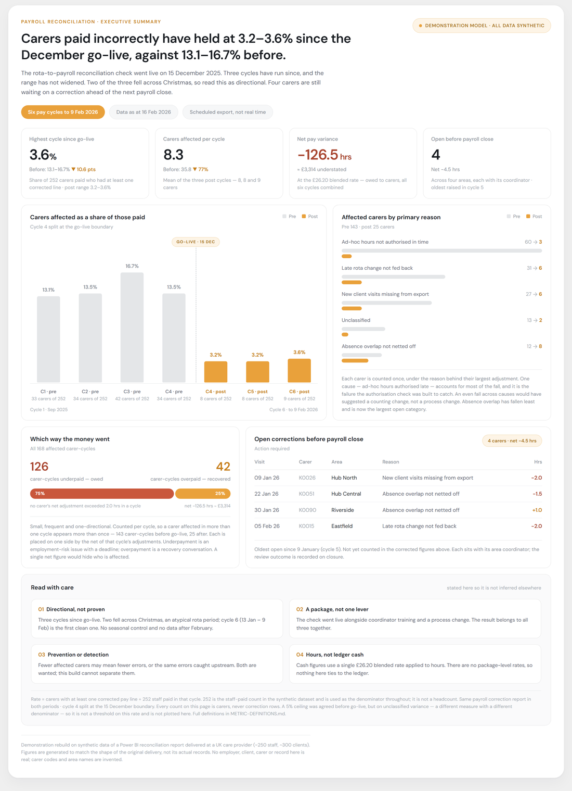

# Case Study: Rota / Payroll Reconciliation

**Context:** a CQC-regulated UK domiciliary care provider — approximately 250 staff and 300+ clients, operating under a local authority framework contract. Client identity and system vendors are withheld; the analytical work is described in full.

**My role:** Business Analyst — elicitation, as-is mapping, reconciliation logic, dashboard build, stakeholder sign-off, and role-based training.

## Problem

- Rostering data did not reconcile with payroll hours.
- A coordinator manually rebuilt the same weekly rota report every week.
- Six-monthly commissioner reporting required manual data assembly from multiple sources.
- Root causes: last-minute rota changes, newly onboarded clients, and unplanned extra hours — none of which flowed back into the payroll input.

## As-Is Process

1. Operations builds the weekly rota in the care management system.
2. Carers check in and out via the linked mobile care app.
3. Hours are manually keyed into Excel at the end of each four-week payroll cycle.
4. The HR system covers absence and holiday only — it holds no delivered-hours data.
5. The payroll team manually spots and corrects discrepancies.

→ [As-is / to-be process map (SVG)](../assets/diagrams/rota-payroll-process-map.svg)

## What Was Built

- **Reconciliation check** comparing planned vs actual vs absence hours, flagging variances above tolerance for review before payroll close.
- **Power BI dashboard** built on scheduled system exports, tracking:
  * monthly target hours against delivered hours
  * where hours are lost, by cause and by area
  * revenue by operating area
  * live staff count

<!-- TODO — uncomment the two lines below once you have saved a redacted screenshot to
     assets/img/dashboard-overview.png (blur or replace employee names, client names and
     real client volumes with sample data). Left commented out deliberately: a broken image
     is worse than no image, and a visible placeholder is what this rewrite removed.

*Screenshot uses substituted sample data; no real client or employee information is shown.*
-->

**Delivery approach:**

- Approved by a director and the registered manager from a mock-up; the deputy manager reviewed pre-go-live.
- Role-based training delivered per employee group, framed around each group's own outcomes rather than the tool.
- Advised senior management on adoption and the future improvement direction.

## Outcomes

| Measure | Before | After |
| --- | --- | --- |
| Weekly rota report rebuild | ~4 hrs | Under 1 hr |
| Payroll discrepancies per monthly cycle | ~14% | Below 5% |
| Six-monthly commissioner report | ~18 hrs | ~3 hrs |

**How these were measured.** Rebuild time is the coordinator's own logged time on the weekly report, compared across four payroll cycles before go-live and two after. Payroll discrepancy rate is the count of corrected pay lines as a proportion of pay lines processed per monthly cycle, established by cross-checking rostered hours against clocked in/out times. Commissioner reporting time is elapsed preparation time recorded for the February 2025 and August 2025 submissions, compared with the February 2026 submission after go-live. Figures are rounded to the nearest hour or whole percentage point; staff and client counts move continuously with recruitment and intake.

## Stakeholder Adoption

| Group | Usage |
| --- | --- |
| Senior management | Weekly |
| Coordinators / operations | Daily |
| Other departments | Monthly |

## What I'd Do Differently

- Metric definitions were never written down — the reconciliation logic lived in the file and in my head. A one-page definitions sheet should have been a go-live deliverable, not an afterthought.
- Proactive missed and late call detection was scoped but not delivered in this phase; it remains in development with the operations team.

Last updated: {{ page.last_updated }}
