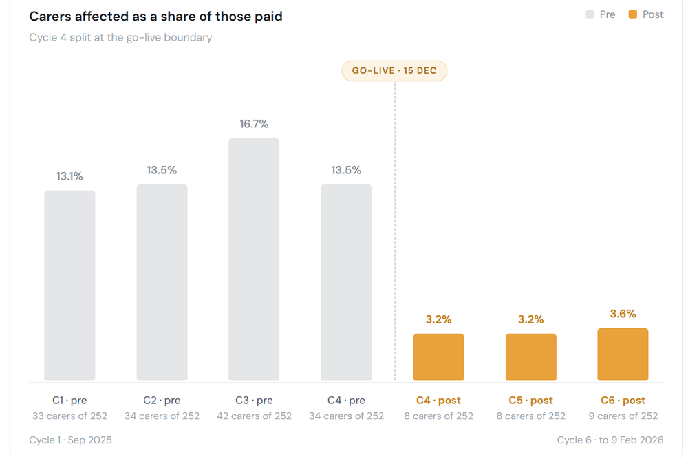

# Case Study: Rota / Payroll Reconciliation

**Context:** a CQC-regulated UK domiciliary/residential care provider — approximately 250 staff and 300 clients. Client identity and system vendors are withheld; the analytical work is described in full. All data in this case study is synthetic — figures are generated to match the shape of a production delivery, not its actual records.

**My role:** Business Analyst — elicitation, as-is mapping, metric definition, reconciliation logic, dashboard build, and measurement.

## Problem

Rota data and payroll hours did not reconcile. Three things broke the link:

1. **Ad-hoc hours** added mid-day at client request (e.g. an extra shopping call) — these need council sanction, and sanction lags, so hours were worked before anyone was sure they'd be funded.
2. **Late rota changes** made after the export was taken.
3. **New client visits** missing from the export entirely.

Discrepancies were found downstream by the payroll team and corrected by hand, one line at a time, after the four-week cycle closed. Nobody could say how often it happened or which way the money went.

*Full dashboard. Screenshot uses synthetic data generated to match the shape of a production delivery; no real client or employee information is shown.*

## What I Did

| Stage | Output |
|---|---|
| Elicitation | Interviews with payroll, care coordinators, operations; walked the as-is from rota build to payslip |
| Analysis | As-is process map; root-cause classification of every correction in four pay cycles |
| Definition | A metric definitions sheet — one unit throughout (one carer in one cycle, never correction rows), denominator, thresholds and reason taxonomy |
| Solution | An authorisation check: where operations authorises ad-hoc hours with the required documents, the evidence is captured and carried into the model, so payroll doesn't miss the hours |
| Delivery | Reconciliation logic + executive dashboard; role-based training for each user group |
| Measurement | Three cycles post-go-live against four pre |

## Result

- Carers with at least one corrected pay line: **13.1–16.7%** of those paid before go-live → **3.2–3.6%** after (stable across three post cycles)
- Carers affected per cycle: **35.8 → 8.3**

*The headline trend, close up.*
- Largest cause (ad-hoc hours authorised late) fell **60 → 3** carers — the failure the check was built to catch

## What It Doesn't Prove

Three cycles, two of them across Christmas — an atypical rota period. The check shipped alongside coordinator training and a process change, so the result belongs to all three; this build can't separate prevention from earlier detection. Cash figures use one blended hourly rate and don't reconcile to a ledger. Full caveats and every metric definition are in [METRIC-DEFINITIONS.md](METRIC-DEFINITIONS.md).

## Two BA Decisions Worth the Space

**Underpaid and overpaid were never netted.** 126 carer-cycles underpaid, 42 overpaid. An underpaid hour is a liability the moment it occurs — NMW is assessed per pay reference period, so a later correction doesn't undo it. An overpaid hour is a receivable requiring a recovery conversation. A single net figure would have hidden who was affected.

**A panel was removed rather than caveated.** An earlier build inferred under-allocation from contracted hours per carer. The data couldn't support it — allocated package hours exclude travel, breaks and care-home shifts, and contracted staff are filled to their hours first by design. The honest fix was deletion, not a footnote.

Last updated: {{ page.last_updated }}
